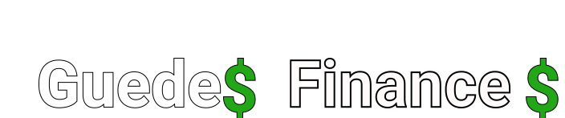

<h1 align="center">
  
</h1>

  <a href="#-tecnologias">Tecnologias</a>&nbsp;&nbsp;&nbsp;|&nbsp;&nbsp;&nbsp;
  <a href="#-projeto">Projeto</a>&nbsp;&nbsp;&nbsp;|&nbsp;&nbsp;&nbsp;

 

  

 

  

## 🚀 Tecnologias

Esse projeto foi desenvolvido com as seguintes tecnologias:

- HTML;
- CSS; e
- JavaScript.

## 💻 Projeto

O Guede$ Finance$ é uma aplicação de controle financeiro, onde é possível cadastrar e excluir transações e ver o saldo de entrada e saída 💰

